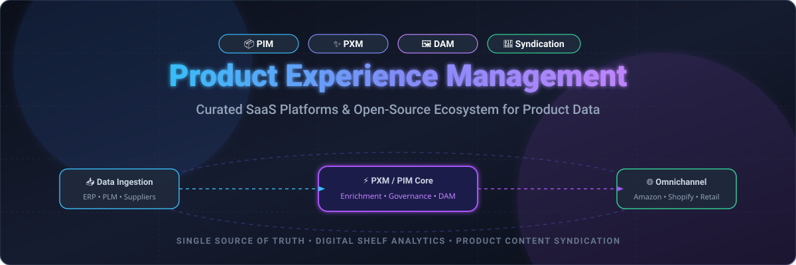

# 🛍️ Awesome Product Experience Management (PXM)

  <strong>Curated ecosystem of enterprise SaaS platforms, open-source PIM / PXM systems, DAM solutions, and product data syndication engines.</strong>

  
  
  
  
  
  
  

---

## 📖 Overview

**Product Experience Management (PXM)** and **Product Information Management (PIM)** systems serve as the single source of truth for omnichannel product data. They empower digital commerce leaders, merchandisers, and solution architects to centralize, enrich, translate, govern, and syndicate complex product catalogs to global marketplaces, e-commerce storefronts, print channels, and digital retail networks.

### 🎯 Key Pillars of PXM
* 📦 **Centralized Product Catalog (PIM)**: Multi-hierarchy catalog modeling, attribute management, and SKU lifecycle tracking.
* 🖼️ **Digital Asset Management (DAM)**: Media enrichment, image transformations, 3D assets, videos, and collateral linking.
* 🏷️ **Data Governance & Quality**: Automated completeness scoring, role-based workflows, audit logs, and compliance.
* 🚀 **Omnichannel Syndication**: Feed optimization and real-time API integrations for Amazon, Walmart, Google Shopping, Shopify, and regional marketplaces.
* 📊 **Digital Shelf Analytics (DSA)**: Share of search, stock status monitoring, price benchmarking, and content health audits.

---

## 📑 Table of Contents

- [📊 SaaS / Commercial Platforms](#-saas--commercial-platforms)
- [💻 Open-Source GitHub Projects](#-open-source-github-projects)
- [🧩 Specialized Architecture Components](#-specialized-architecture-components)
- [🤝 How to Contribute](#-how-to-contribute)
- [📈 Star History](#-star-history)
- [📄 Disclaimer](#-disclaimer)

---

## 📊 SaaS / Commercial Platforms

> 💡 **Market Size & Landscape Analysis:**  
> The global Product Information Management (PIM) and Product Experience Management (PXM) market is estimated at **$16.5 Billion to $19.8 Billion** and is projected to surpass **$38 Billion by 2030** (growing at a ~12.8% CAGR). The sector is **moderately fragmented**, featuring established enterprise leaders (Salsify, inriver, Stibo Systems, Akeneo) alongside specialized syndication, feed management, and agile cloud platforms (Productsup, ChannelEngine, Plytix) rather than a single winner-take-all monopoly.

The table below details prominent commercial SaaS platforms, ranked by **company size (annual revenue / valuation, descending)**, including specific starting tier prices, free trial limits, and platform capabilities:

| SaaS Platform 🏢 | Company Size (Est. Revenue / Valuation) 💰 | Starting Tier Pricing 🏷️ | Free Tier / Free Trial Limits 🎁 | Core Specialization & Features 🚀 |
| :--- | :--- | :--- | :--- | :--- |
| **[Stibo Systems (STEP)](https://www.stibosystems.com/)** | **~$280M+ / Year Revenue** *(Stibo Group subsidiary)* | Starts at **~$50,000 / year** *(Custom enterprise deployment)* | **No free tier**; Demo on request *(Custom sandbox POC evaluated per enterprise request)* | Enterprise Multidomain MDM, Product MDM, automated compliance governance, and global supply chain data workflows. |
| **[Syndigo](https://www.syndigo.com/)** | **~$200M+ / Year Revenue** *(Acquired Riversand; Summit Partners backed)* | Starts at **~$15,000 / year** *(Tiered by catalog size & active retail channels)* | **No free tier**; 14-day guided proof-of-concept for qualified enterprise brand suppliers | End-to-end Active Content Engine, PIM, MDM, DAM, and verified GDSN / global retailer syndication network. |
| **[Salsify](https://www.salsify.com/)** | **~$150M+ / Year Revenue** *(Valued at $2.0B post-Series F)* | Starts at **~$18,000 to $25,000 / year** *(~€1,500/mo entry tier for mid-market brands)* | **No free tier**; Guided interactive product demo *(Free trials not publicly offered)* | Category-leading Commerce Experience Management (CommerceXM), retailer readiness, automated syndication & digital shelf analytics. |
| **[inriver](https://www.inriver.com/)** | **~$80M+ / Year Revenue** *(Marlborough Cavendish / THL backed)* | Starts at **~$20,000 / year** *(Foundation edition; scales with SKU & channel count)* | **No free tier**; Guided live demo & architecture consultation *(No open public trial)* | High-volume PIM/PXM with visual product storytelling, supplier portal onboarding, and digital shelf intelligence. |
| **[Productsup](https://www.productsup.com/)** | **~$60M+ / Year Revenue** *(Raised $70M+ Series B; Bregal Milestone)* | Starts at **~$1,500 / month** *(Billed annually; based on SKU volume & feed frequency)* | **No free tier**; 14-day structured pilot sandbox for qualified e-commerce teams | Enterprise product-to-consumer (P2C) feed management, marketplace syndication, dynamic contextual ads, and feed transformations. |
| **[Contentserv](https://www.contentserv.com/)** | **~$50M+ / Year Revenue** *(Investcorp backed)* | Starts at **~$18,000 / year** *(Base cloud package; quote tailored by SKU volume)* | **No free tier**; Tailored pilot environment provided following discovery demo | Unified Product Experience Platform (PXP) combining PIM, Master Data Management (MDM), DAM, and contextual print publishing. |
| **[Akeneo](https://www.akeneo.com/)** | **~$45M+ / Year Revenue** *(Raised $196M total; Series D backed)* | Starts at **~$45,000 / year** *(Growth Edition; commercial SaaS cloud)* | **14-day free trial** *(Akeneo Cloud Growth sandbox with sample catalog & onboarding tour)* | Omnichannel product data governance, collaborative enrichment workflows, AI asset matching, and App Store extensions. |
| **[ChannelEngine](https://www.channelengine.com/)** | **~$25M+ / Year Revenue** *(Raised $50M Series B; Atomico / General Catalyst)* | Starts at **~$599 / month** *(+ small % of GMV depending on marketplace volume)* | **14-day free trial** *(Full access to sandbox connect test channels and map catalog feeds)* | Global e-commerce marketplace integration engine, automated currency/pricing repricing, stock sync, and click-and-collect. |
| **[Sales Layer](https://saleslayer.com/)** | **~$15M+ / Year Revenue** *(Raised $25M Series B; PeakSpan Capital)* | Starts at **~$750 / month** *(Billed annually; Small Business tier up to 2,500 SKUs)* | **30-day free trial** *(Full platform access, up to 1,000 SKUs, 5 sales channels, 2 users)* | Fast-setup agile Cloud PIM, instant catalog completeness scoring, connector library (Shopify, BigCommerce, Magento), and B2B portals. |
| **[Catsy](https://catsy.com/)** | **~$10M / Year Revenue** *(Bootstrapped & Private Growth)* | Starts at **~$1,000 / month** *(Billed annually; Entry tier includes 10,000 SKUs & DAM)* | **No free tier**; 14-day guided proof-of-concept upon discovery qualification | Specialized PIM & DAM for hardware, industrial distributors, and manufacturers; automated spec-sheet generation & B2B portal export. |
| **[Bluestone PIM](https://www.bluestonepim.com/)** | **~$8M / Year Revenue** *(MACH Alliance Certified member)* | Starts at **~$1,200 / month** *(Base MACH tier; billed annually)* | **30-day free trial** *(API-first cloud sandbox with sample data & MACH connector access)* | Native MACH-certified (Microservices, API-first, Cloud-native, Headless) composable PIM for modern headless commerce stacks. |
| **[Plytix](https://www.plytix.com/)** | **~$6M / Year Revenue** *(Raised $10M+; Early-stage VC backed)* | **$0 / month** *(Free plan)* / Paid starting at **$499 / month** *(Pro plan)* | **Free-forever plan**: **500 SKUs**, 500 AI credits/mo, 5,000 API calls/hr, unlimited users, DAM included | Collaborative, user-friendly PIM crafted for SMBs/mid-market; dynamic PDF product sheets, interactive brand portals, and CSV/XML feeds. |

---

## 💻 Open-Source GitHub Projects

> 🌟 **Self-Hostable & Extensible Foundations:**  
> The following repositories represent the most active and capable open-source and open-core solutions for managing product catalogs, digital assets, and digital commerce pipelines. Projects are sorted by **GitHub Stars (descending)**.

| Project & Repository 📦 | GitHub Stars ⭐ | Primary Tech Stack 🛠️ | License ⚖️ | Core Capabilities & Architecture 💡 |
| :--- | :---: | :--- | :--- | :--- |
| **[Medusa](https://github.com/medusajs/medusa)** |  | Node.js, TypeScript | MIT | Composable, modular headless commerce engine with sophisticated multi-variant product catalog, attribute modeling, and inventory modules. |
| **[ERPNext](https://github.com/frappe/erpnext)** |  | Python, Frappe Framework, JS | GPL-3.0 | Complete ERP suite containing advanced Item/PIM master data management, product variant matrices, multi-currency price lists, and barcode tracking. |
| **[Saleor](https://github.com/saleor/saleor)** |  | Python, Django, GraphQL | BSD-3-Clause | Ultra-fast GraphQL-first headless commerce and product catalog management engine with rich attributes, multi-channel pricing, and media storage. |
| **[Spree Commerce](https://github.com/spree/spree)** |  | Ruby, Ruby on Rails | BSD-3-Clause | Extensible headless commerce platform featuring customizable product schemas, taxonomies, multi-store product partitioning, and REST/GraphQL APIs. |
| **[Pimcore](https://github.com/pimcore/pimcore)** |  | PHP, Symfony, Vue.js, MySQL | GPL-3.0 / Commercial | Leading open-core enterprise Product Experience Platform combining enterprise PIM, Master Data Management (MDM), DAM, CDP, and DXP/CMS. |
| **[Solidus](https://github.com/solidusio/solidus)** |  | Ruby, Ruby on Rails | BSD-3-Clause | Enterprise-grade, highly customizable commerce and product catalog framework built for high-volume retailers and complex product relationships. |
| **[Akeneo PIM (Community Edition)](https://github.com/akeneo/pim-community-dev)** |  | PHP, Symfony, React | OSL-3.0 | Industry benchmark open-source PIM. Provides product normalization, attribute family structures, multi-locale localization, and export channels. |
| **[UnoPim](https://github.com/unopim/unopim)** |  | PHP, Laravel, Vue.js | MIT | Modern, intuitive open-source PIM built on Laravel. Features rapid attribute configuration, multi-channel export, and AI-assisted content enrichment. |
| **[AtroPIM](https://github.com/atrocore/atropim)** |  | PHP, Backbone.js, MySQL | GPL-3.0 | Modular, highly configurable open-source PIM based on AtroCore. Features flexible entity modeling, digital asset association, and REST API. |
| **[OpenPIM](https://github.com/razorbee/openpim)** |  | Node.js, React, PostgreSQL | Apache-2.0 | Lightweight, modern open-source PIM with graph-like data modeling, granular user permissions, Excel/CSV mapping, and digital asset linking. |

---

## 🧩 Specialized Architecture Components

When constructing a custom, headless, or composable Product Experience architecture, teams frequently combine open-source PIM platforms with dedicated microservices:

* 🖼️ **Digital Asset Management (DAM)**:
  * **[ResourceSpace](https://www.resourcespace.com/)** – Web-based open-source digital asset management system for managing high-res imagery and marketing collateral.
  * **[Razuna](https://razuna.org/)** – Centralized media management server for automated video transcoding and photo asset enrichment.
* 🔄 **Feed Generation & Channel Syndication**:
  * Tools and worker microservices for transforming master product catalogs into Google Merchant Center (RSS/XML), Facebook/Instagram Catalog, TikTok Shop, and Amazon Inventory feeds.
* 🌐 **Integration & Transformation Layers**:
  * Composable message buses (Apache Kafka, RabbitMQ) and reverse-ETL pipelines that synchronize ERP/PLM item changes directly to PIM instances in real time.

---

## 🤝 How to Contribute

Contributions, feature additions, and corrections are warmly welcomed!

1. 🍴 **Fork the Repository** on GitHub.
2. 🌿 **Create a Feature Branch**: `git checkout -b feature/add-new-pxm-tool`.
3. 📝 **Add or Update Content**:
   * For SaaS products, include exact pricing tiers, free trial days/limits, estimated revenue/valuation, and key capabilities.
   * For open-source projects, ensure appropriate GitHub star badges (`style=social&color=white`) linking to the stargazers page.
4. ✅ **Verify Links and Formatting**: Keep descriptions factual, unbiased, and SEO-friendly.
5. 🚀 **Submit a Pull Request** with a concise description of your additions.

---

## 📈 Star History

---

## 📄 Disclaimer

* This repository is a community-curated directory intended for educational, architectural, and comparison purposes.
* All company names, logos, and trademarks are the property of their respective owners. Mention does not constitute an explicit endorsement.
* Pricing structures, trial lengths, and product tiers are subject to change by vendors; always check official vendor documentation for up-to-date quotes.

---

  Built with ❤️ by and for the global digital commerce and product management community.

